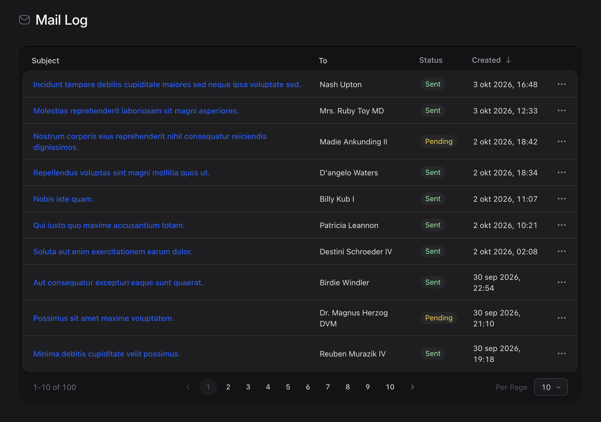
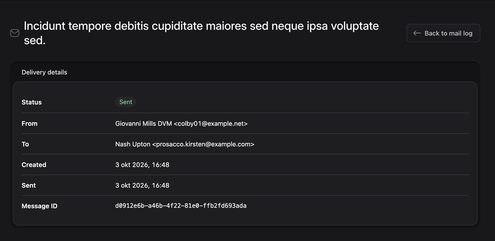
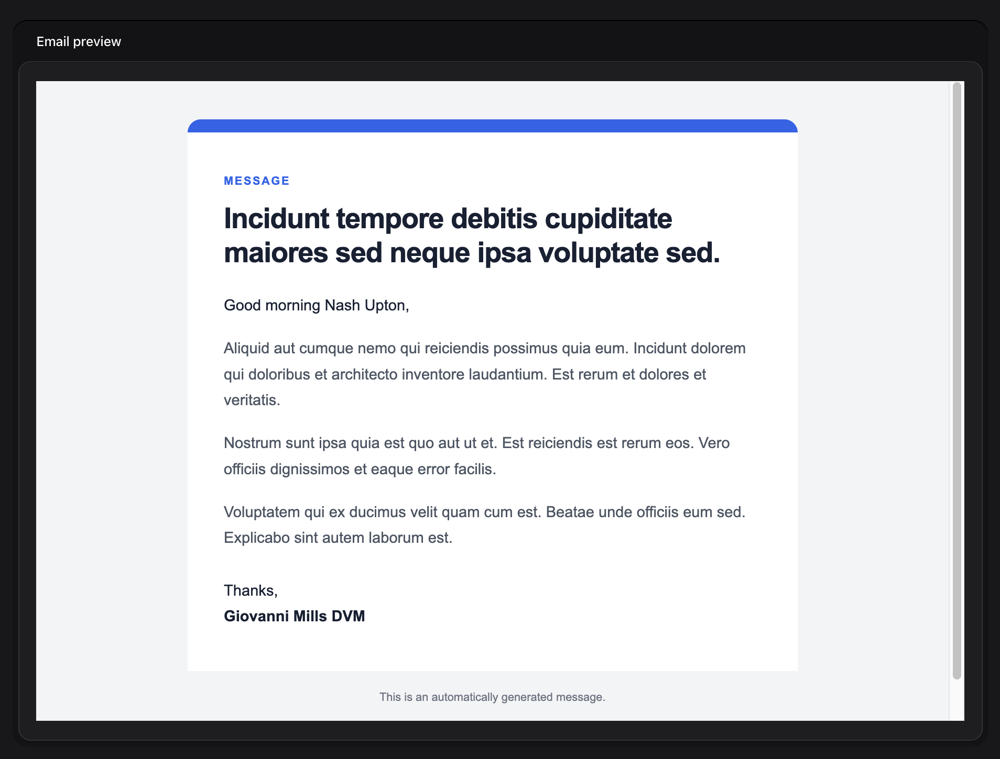

# Statamic Mail Log
[](https://github.com/BobWez98/mail-log-statamic/actions/workflows/tests.yml)
[](LICENSE)
[](https://packagist.org/packages/bobwez98/mail-log-statamic)

View outgoing Laravel emails and their delivery status from the Statamic Control Panel.

This add-on provides the Statamic interface for [Laravel Mail Log](https://github.com/BobWez98/mail-log-laravel), which handles the underlying mail capture and storage.

## Requirements

- PHP 8.4+
- Laravel 13
- Statamic 6
- Database connection
- [Laravel Mail Log](https://github.com/BobWez98/mail-log-laravel)

## Features

- Adds a paginated mail log to the Statamic Control Panel
- Orders logged emails newest first
- Displays sent and pending delivery statuses
- Shows sender, recipient, subject, message ID, and timestamps
- Renders HTML emails in a sandboxed preview
- Blocks scripts and remote resources inside previews
- Displays the raw Laravel mail event data
- Integrates with Statamic navigation and role permissions

## Installation

Install the Composer package:

```bash
composer require bobwez98/mail-log-statamic
```

Composer also installs [Laravel Mail Log](https://github.com/BobWez98/mail-log-laravel), the base package responsible for recording outgoing emails. Both service providers are registered through package discovery.

Run the migrations supplied by the base package to create the `mail_logs` table:

```bash
php artisan migrate
```

Grant the **View mail log** permission to every Statamic role that should be able to inspect logged emails. Super users have access automatically.

## Configuration

No add-on-specific configuration is required. Mail capture and storage are configured by [Laravel Mail Log](https://github.com/BobWez98/mail-log-laravel).

Mail logging is enabled by default. It can be disabled in your `.env` file:

```dotenv
MAIL_LOG_ENABLED=false
```

See the [Laravel Mail Log documentation](https://github.com/BobWez98/mail-log-laravel#configuration) for its complete configuration instructions.

## How It Works

Laravel Mail Log listens to Laravel's native mail events and stores each outgoing message in the `mail_logs` table. This add-on reads those records and makes them available in Statamic under **Tools > Mail Log**.

The overview is paginated and ordered newest first. Opening a message displays its delivery details, raw event data, and rendered email body.

Email bodies are isolated in a sandboxed iframe with a restrictive Content Security Policy. Scripts, forms, frames, objects, and remote resources are blocked while inline email styles and data or CID image sources are permitted.

> [!IMPORTANT]
> This add-on only provides the Statamic Control Panel interface. [Laravel Mail Log](https://github.com/BobWez98/mail-log-laravel) is required to capture, store, and update mail records.

## Usage

Open **Tools > Mail Log** in the Statamic Control Panel. Users must be super users or have the **View mail log** permission.

### Mail log overview

Browse logged emails, inspect their delivery status, and use Statamic's pagination controls to move through the results.



### Delivery details

Open a message to view its status, sender, recipient, timestamps, and unique message ID.



### Email preview

Review the rendered HTML email without allowing its content to execute scripts or load remote resources.



## Quality

To ensure the quality of this package, run the following command:

```bash
composer quality
```

This will execute five tasks:

1. Checks if the code is correctly formatted
2. Checks for issues using static code analysis
3. Makes sure all tests pass
4. Verifies 100% code coverage
5. Checks for pending Rector changes

Code coverage requires Xdebug with coverage mode enabled.

Install the frontend dependencies and compile the Control Panel assets with:

```bash
npm install
npm run build
```

## Contributing

Please see [CONTRIBUTING](.github/CONTRIBUTING.md) for details.

## Security Vulnerabilities

Please report security vulnerabilities privately to [info@bobwezelman.nl](mailto:info@bobwezelman.nl).

## Credits

- [Bob Wezelman](https://github.com/BobWez98)
- [All Contributors](../../contributors)

## License

The MIT License (MIT). Please see [License File](LICENSE) for more information.
